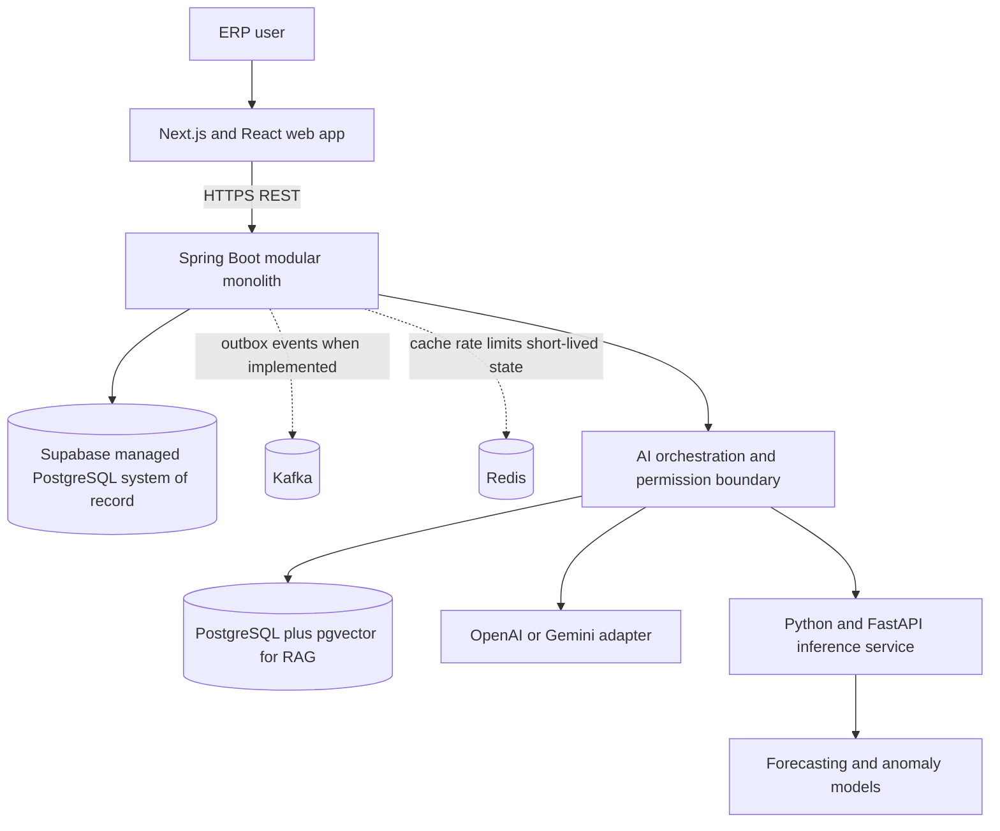

# Architecture

The ERP will start as a modular monolith with a Next.js web client, a Spring Boot business backend, and PostgreSQL as the authoritative transactional database. The supplied specifications require broad ERP capabilities, tenant isolation, ledgers, AI-assisted workflows, and eventual event-driven processing; this structure keeps transactions and domain rules coherent while leaving a clear path to add specialized components when they are needed.

## Current repository state

This section separates the implemented foundation from the target architecture. The repository has a Next.js/React shell with responsive navigation and honest setup/empty/error states. Its module pages do not read or write ERP data. No Spring service, API, authentication, database schema/migration, Kafka topic, Redis usage, AI provider call, RAG index, or ML endpoint exists yet. The local `.env` has Supabase URL/API values, but PostgreSQL host credentials are still placeholders and no database connection has been verified.

## Target topology



Development uses a dedicated Supabase-hosted PostgreSQL project; a local container runtime is not required for that workflow. Kafka and Redis are deferred until the corresponding event and ephemeral-state use cases are implemented. The ML service is deferred until there is sufficient ERP history for meaningful predictions.

## ERP domain boundaries

The Spring Boot application will organize business behavior by domain. The intended boundaries are:

| Area | Responsibility |
| --- | --- |
| `common` | Shared errors, security primitives, audit, pagination, events, observability |
| `identity` and `tenant` | Organizations, users, roles, permissions, tenant context, sessions |
| `crm` | Customers, contacts, leads, opportunities, activities |
| `sales` | Quotes, orders, pricing, deliveries, returns, invoicing integration |
| `procurement` | Requisitions, RFQs, purchase orders, receiving, supplier performance |
| `inventory` | Warehouses, bins, reservations, transfers, batches, serials, stock ledger |
| `manufacturing` | BOMs, routings, work centers, production orders and execution |
| `quality` | Inspection plans/results, defects, non-conformance, corrective actions |
| `finance` | Accounts, journals, fiscal periods, AR/AP, invoices, payments, reports |
| `assets` and `workforce` | Asset/maintenance and employee/department workflows |
| `workflow` and `analytics` | Approval rules/history and authorized operational reporting |
| `ai` | Permission-aware tool orchestration, RAG, proposals, approvals, AI audit |

Modules own their domain logic and persistence boundaries. Controllers stay thin; application/domain services enforce business rules. No cross-domain mega-service or microservice split is planned at the foundation stage.

## Data and transaction rules

- PostgreSQL is authoritative for ERP transactions. Redis is never a source of truth.
- Schema changes use Flyway migrations; production Hibernate schema generation is disabled.
- Tenant scope comes from authenticated identity and is enforced in application and repository boundaries. The browser never chooses a trusted `tenantId`.
- Money and exact quantities use decimal/numeric types. Timestamps use a documented UTC convention.
- Inventory is represented by an append-only stock ledger plus reservation state, not a single mutable product quantity.
- Accounting uses append-only journal records and balanced debit/credit lines, linked to source documents.
- Stock movements, receipts, and financial postings commit atomically with their required state.
- Optimistic locking, constraints, idempotency, and concurrency controls protect retried or simultaneous operations.

## Events and short-lived state

When implemented, Kafka carries meaningful domain events such as `GoodsReceiptCompleted`, `InvoicePosted`, and `ProductionCompleted`. Important events are written to a transactional outbox in the same database transaction as the business change. Consumers are version-aware and idempotent, with retry and dead-letter handling.

Redis is reserved for measured read caching, rate limiting, session-related ephemeral state, or carefully specified short-lived idempotency/coordination. Every use needs TTL and invalidation semantics.

## AI and ML boundaries

AI orchestration belongs behind the Spring Boot authorization boundary. Provider-specific OpenAI/Gemini SDKs stay behind an internal adapter interface. Tools have explicit READ, ANALYSIS, PROPOSAL, WRITE, and ADMINISTRATIVE policies; the model receives neither unrestricted database access nor arbitrary SQL execution. Tool arguments are schema-validated, and high-impact changes require explicit authorization and human approval.

RAG begins with tenant-aware PostgreSQL/pgvector documents and chunks; retrieval returns source citations and treats document content as untrusted. Forecasting and anomaly inference live in a separate Python/FastAPI service with typed inputs, model versions, and uncertainty metadata.

## Observability and security

The target uses structured logs, correlation IDs across HTTP/database/events, metrics, and OpenTelemetry traces. AI telemetry records operational metadata without retaining sensitive prompts or ERP data unnecessarily. Backend authorization is authoritative; frontend role checks only guide the user experience.

## Planned repository layout

```text
apps/
  web/                       Next.js shell (Phase 1, in progress)
  api/                       Spring Boot modular monolith (Phase 2 onward)
services/
  ml/                        FastAPI inference service (Phase 16)
infra/                       Reserved for deployment configuration if needed
docs/
  DECISIONS/                 Architecture decision records
scripts/                     Reproducible development/operations helpers
```
